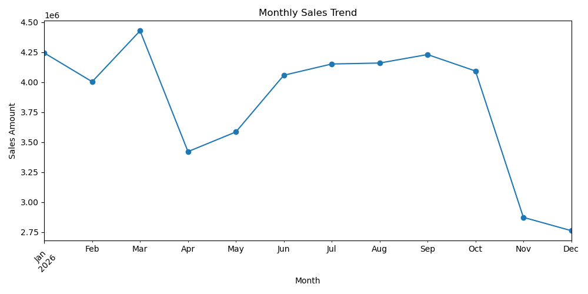
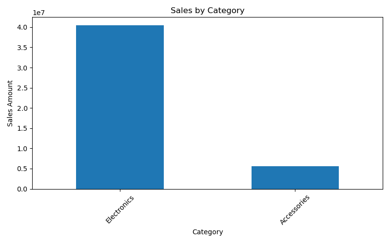
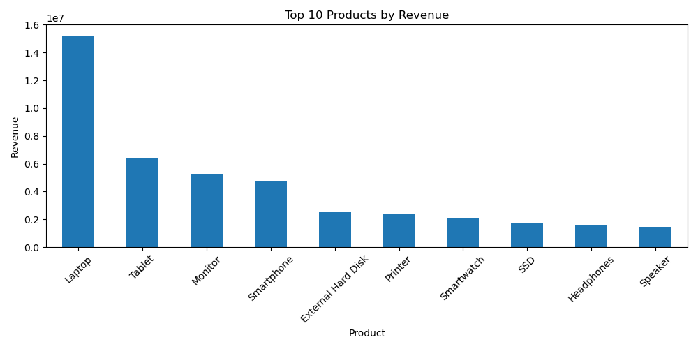
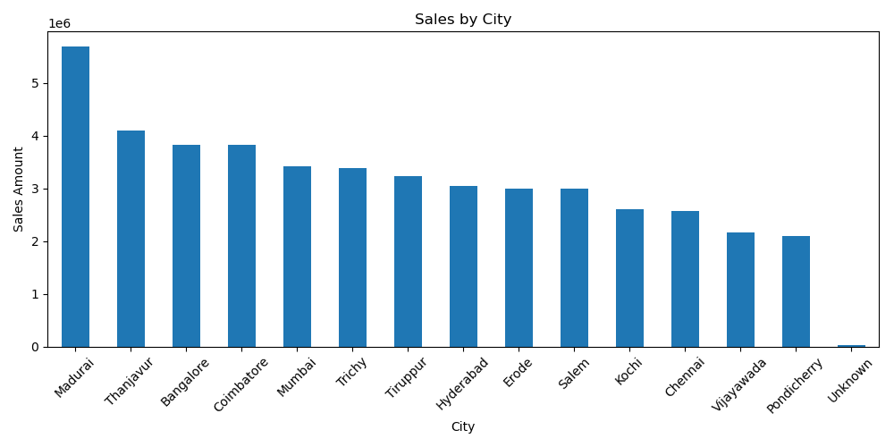
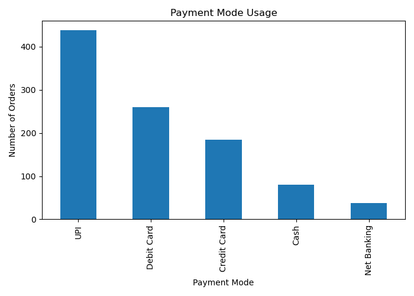

<div align="center">

  <!-- Hero Header -->
  

  <br/>

  <p align="center">
    <b>An end-to-end Python analytics engine engineered to audit, clean, model, and visualize transactional sales data for executive decision-making.</b>
  </p>

  <!-- Technology Badges -->
  <p align="center">
    <a href="https://www.python.org/"></a>
    <a href="https://pandas.pydata.org/"></a>
    <a href="https://numpy.org/"></a>
    <a href="https://matplotlib.org/"></a>
    <a href="https://jupyter.org/"></a>
  </p>

  <p align="center">
    
    
    
  </p>

</div>

<hr/>

<!-- Navigation Bar -->
<p align="center">
  <a href="#-executive-summary">Overview</a> •
  <a href="#-business-kpi-dashboard">KPI Framework</a> •
  <a href="#-analytical-capabilities--features">Features</a> •
  <a href="#-technology-stack">Tech Stack</a> •
  <a href="#-analytics-workflow-architecture">Workflow</a> •
  <a href="#-project-structure">Structure</a> •
  <a href="#-installation--execution">Setup & Usage</a> •
  <a href="#-visualizations--insights-gallery">Visual Outputs</a> •
  <a href="#-future-roadmap">Roadmap</a> •
  <a href="#-author--contact">Author</a>
</p>

<hr/>

## 📌 Executive Summary

<table width="100%">
  <tr>
    <td style="padding: 16px;">
      <p>
        The <b>Python Sales Data Analyzer</b> is an end-to-end exploratory data analysis and reporting pipeline designed to transform raw, uncurated sales transaction datasets into structured business intelligence.
      </p>
      <p>
        <b>Core Mission:</b> To demonstrate practical Python data analysis skills by converting raw sales data into meaningful, executive-ready commercial insights. The pipeline automates dataset validation, anomaly detection, datetime harmonization, feature derivation, multi-segment aggregations, and high-resolution graphical reporting.
      </p>
      <div align="center">
        <b>Core Computation Formula:</b><br/>
        <code>Sales Amount = Quantity × Unit Price</code>
      </div>
    </td>
  </tr>
</table>

<br/>

## 📊 Business KPI Dashboard

<div align="center">
  <p><i>The pipeline computes and evaluates ten foundational commercial Key Performance Indicators (KPIs):</i></p>
</div>

<table width="100%" align="center">
  <thead>
    <tr bgcolor="#f1f5f9">
      <th align="center" width="20%">Financial Performance</th>
      <th align="center" width="20%">Order Volume</th>
      <th align="center" width="20%">Inventory Movement</th>
      <th align="center" width="20%">Order Economics</th>
      <th align="center" width="20%">Seasonal Peak</th>
    </tr>
  </thead>
  <tbody>
    <tr>
      <td align="center">
        <sub>METRIC 01</sub><br/>
        <b>Total Revenue</b><br/>
        <sub>Gross cumulative turnover</sub>
      </td>
      <td align="center">
        <sub>METRIC 02</sub><br/>
        <b>Total Orders</b><br/>
        <sub>Valid processed purchases</sub>
      </td>
      <td align="center">
        <sub>METRIC 03</sub><br/>
        <b>Total Quantity Sold</b><br/>
        <sub>Cumulative product units</sub>
      </td>
      <td align="center">
        <sub>METRIC 04</sub><br/>
        <b>Average Order Value</b><br/>
        <sub>Revenue per order basket</sub>
      </td>
      <td align="center">
        <sub>METRIC 05</sub><br/>
        <b>Best Sales Month</b><br/>
        <sub>Peak revenue cycle</sub>
      </td>
    </tr>
  </tbody>
</table>

<table width="100%" align="center">
  <thead>
    <tr bgcolor="#f1f5f9">
      <th align="center" width="20%">Volume Leader</th>
      <th align="center" width="20%">Revenue Leader</th>
      <th align="center" width="20%">Category Leader</th>
      <th align="center" width="20%">Geographic Market</th>
      <th align="center" width="20%">Customer Retention</th>
    </tr>
  </thead>
  <tbody>
    <tr>
      <td align="center">
        <sub>METRIC 06</sub><br/>
        <b>Best-Selling Product</b><br/>
        <sub>Top quantity demand SKU</sub>
      </td>
      <td align="center">
        <sub>METRIC 07</sub><br/>
        <b>Highest Revenue Product</b><br/>
        <sub>Greatest capital driver</sub>
      </td>
      <td align="center">
        <sub>METRIC 08</sub><br/>
        <b>Best Performing Category</b><br/>
        <sub>Dominant department</sub>
      </td>
      <td align="center">
        <sub>METRIC 09</sub><br/>
        <b>Highest Sales City</b><br/>
        <sub>Top regional revenue hub</sub>
      </td>
      <td align="center">
        <sub>METRIC 10</sub><br/>
        <b>Top Customer</b><br/>
        <sub>Highest spend account</sub>
      </td>
    </tr>
  </tbody>
</table>

<br/>

## 🎯 Analytical Capabilities & Features

<div align="center">
  <p><i>Structured visual breakdown of data engineering, analytical dimensions, and strategic deliverables:</i></p>
</div>

<table width="100%">
  <tr>
    <td width="50%" valign="top">
      <h3 align="left">🧹 1. Data Cleaning & Validation</h3>
      <ul>
        <li><b>Data Inspection:</b> Systematic evaluation of shapes, datatypes, and summary statistics.</li>
        <li><b>Missing Value Detection & Handling:</b> Programmatic identification and resolution of null values.</li>
        <li><b>Duplicate Removal:</b> Purging repeated order entries to preserve integrity.</li>
        <li><b>Datetime Standardization:</b> Conversion of transaction date columns into true <code>datetime</code> format.</li>
        <li><b>Outlier & Anomaly Filtering:</b> Elimination of non-positive quantities (<code>Quantity &gt; 0</code>) and invalid unit prices (<code>Unit Price &gt; 0</code>).</li>
        <li><b>Derived Metrics:</b> Automated calculation of <code>Sales_Amount = Quantity × Unit Price</code>.</li>
      </ul>
    </td>
    <td width="50%" valign="top">
      <h3 align="left">📈 2. Multi-Dimensional Analysis</h3>
      <ul>
        <li><b>Product & Revenue Analysis:</b> Identifying top-selling items by units and revenue contribution.</li>
        <li><b>Category Performance:</b> Segmenting gross revenue by department to evaluate product mix.</li>
        <li><b>Geographic Analysis:</b> Aggregating sales by city to identify regional demand centers.</li>
        <li><b>Customer Analysis:</b> Profiling top revenue-generating customers and order volume.</li>
        <li><b>Payment Mode Analysis:</b> Tracking usage shares across payment instruments.</li>
        <li><b>Monthly Sales Trend:</b> Analyzing month-over-month trajectory, seasonal peaks, and troughs.</li>
      </ul>
    </td>
  </tr>
  <tr>
    <td colspan="2" valign="top">
      <h3 align="left">💡 3. Business Insights Generated</h3>
      <table width="100%">
        <tr>
          <td width="33%">
            <b>Product Portfolio:</b><br/>
            <sub>Pins down which products generate the highest revenue and volume to prioritize inventory and supply chains.</sub>
          </td>
          <td width="33%">
            <b>Market & Category Segments:</b><br/>
            <sub>Isolates best-performing categories and top cities to guide marketing allocation and regional logistics.</sub>
          </td>
          <td width="33%">
            <b>Customer & Payment Behaviors:</b><br/>
            <sub>Discovers top customer spenders, recurring purchase habits, and preferred payment checkout methods.</sub>
          </td>
        </tr>
      </table>
    </td>
  </tr>
</table>

<br/>

## 🛠️ Technology Stack

<table width="100%">
  <thead>
    <tr bgcolor="#f1f5f9">
      <th align="left" width="22%">Technology</th>
      <th align="left" width="23%">Ecosystem Tier</th>
      <th align="left" width="55%">Role in Project</th>
    </tr>
  </thead>
  <tbody>
    <tr>
      <td><b>Python 3.x</b></td>
      <td>Core Runtime</td>
      <td>Underlying language executing data manipulation routines and analytics pipeline</td>
    </tr>
    <tr>
      <td><b>Pandas</b></td>
      <td>Data Engineering</td>
      <td>Tabular transformations, schema cleansing, multi-axis groupings, and KPI metrics</td>
    </tr>
    <tr>
      <td><b>NumPy</b></td>
      <td>Numerical Computing</td>
      <td>Optimized mathematical computations and vectorized operations</td>
    </tr>
    <tr>
      <td><b>Matplotlib</b></td>
      <td>Visualization Engine</td>
      <td>Generation of clean, publication-grade analytical charts and graphic exports</td>
    </tr>
    <tr>
      <td><b>CSV Dataset</b></td>
      <td>Storage Layer</td>
      <td>Raw transaction source data (<code>sales_data.csv</code>) and cleaned output export</td>
    </tr>
    <tr>
      <td><b>Jupyter / VS Code</b></td>
      <td>Development Environment</td>
      <td>Interactive exploratory analysis, prototyping, code execution, and inspection</td>
    </tr>
  </tbody>
</table>

<br/>

## 🔄 Analytics Workflow Architecture

<div align="center">
  <p><i>The structured end-to-end data pipeline from raw ingestion to business visual deliverables:</i></p>
</div>

```text
┌────────────────────────┐      ┌─────────────────────────────┐      ┌──────────────────────────────┐
│    Raw Sales Data      │ ───► │  Data Hygiene & Validation  │ ───► │   Mathematical Derivations   │
│   (sales_data.csv)     │      │   • Null value detection    │      │   • Sales = Qty × Unit Price │
└────────────────────────┘      │   • Duplicate elimination   │      │   • Datetime standardisation │
                                │   • Anomaly & price filters │      │   • Month & Year extraction  │
                                └─────────────────────────────┘      └──────────────┬───────────────┘
                                                                                    │
                                                                                    ▼
┌────────────────────────┐      ┌─────────────────────────────┐      ┌──────────────────────────────┐
│  Delivered Outputs     │ ◄─── │   Visualization Suite       │ ◄─── │    Multi-Axis KPI Analysis   │
│   • Cleaned CSV Dataset│      │   • Monthly Sales Trend     │      │   • Revenue & Order Totals   │
│   • Terminal KPI Logs  │      │   • Category & City Splits  │      │   • Product & Category Ranks │
│   • 5 PNG Visual Assets│      │   • Top Products & Payments │      │   • City & Customer Metrics  │
└────────────────────────┘      └─────────────────────────────┘      └──────────────────────────────┘
```

<br/>

## 📁 Project Structure

```text
Python-Sales-Data-Analyzer/
│
├── Data/
│   └── sales_data-1.csv             # Raw transactional dataset
│
├── src/
│   ├── sales_analyzer.py            # Automated analysis script running full pipeline
│   └── sales_analyzer.ipynb         # Interactive Jupyter Notebook for exploratory workflows
│
├── outputs/
│   ├── monthly_sales.png            # Line chart showing month-over-month revenue trends
│   ├── category_sales.png           # Bar plot of revenue generated by product category
│   ├── city_sales.png               # Regional distribution of sales across major cities
│   ├── top_products.png             # Top 10 revenue-generating products ranking
│   ├── payment_mode.png             # Distribution chart of customer payment modes
│   └── cleaned_sales_data.csv       # Verified, cleaned, and deduplicated dataset
│
└── Readme.md                        # Project documentation and presentation
```

<br/>

## 🚀 Installation & Execution

<table width="100%">
  <tr>
    <td width="25%" align="center"><b>Step 1</b><br/><sub>Python Environment</sub></td>
    <td width="25%" align="center"><b>Step 2</b><br/><sub>Install Dependencies</sub></td>
    <td width="25%" align="center"><b>Step 3</b><br/><sub>Open Repository</sub></td>
    <td width="25%" align="center"><b>Step 4</b><br/><sub>Run Analyzer</sub></td>
  </tr>
</table>

### Step 1: Verify Python Environment
Ensure that Python 3.8+ is installed on your local machine:
```bash
python --version
```

### Step 2: Install Required Libraries
Install the core scientific computing and visualization libraries:
```bash
pip install pandas numpy matplotlib
```

### Step 3: Open the Project
Open the project directory in **VS Code** or launch **Jupyter Notebook**:
```bash
cd "Python-sales-Data-Analyzer"
```

### Step 4: Run the Analysis
Execute the Python script to trigger automated cleaning, KPI computation, and plot generation:
```bash
python src/sales_analyzer.py
```
*Alternatively, step through the interactive cells in `src/sales_analyzer.ipynb`.*

> [!NOTE]
> The summary metrics and KPI results will display directly in your terminal, and all generated charts along with `cleaned_sales_data.csv` will be saved inside the `outputs/` folder.

<br/>

## 📈 Visualizations & Insights Gallery

<div align="center">
  <p><i>High-resolution analytical figures generated directly by the project pipeline:</i></p>
</div>

<table width="100%">
  <tr>
    <td width="50%" align="center" valign="top">
      <h3>1. Monthly Sales Trend</h3>
      
      <br/>
      <p align="left"><sub><b>Analysis:</b> Tracks seasonal fluctuations and revenue trajectory month by month, uncovering peak periods and slower commercial cycles.</sub></p>
    </td>
    <td width="50%" align="center" valign="top">
      <h3>2. Sales by Category</h3>
      
      <br/>
      <p align="left"><sub><b>Analysis:</b> Assesses the revenue contribution of each merchandise department to identify which product categories anchor total business volume.</sub></p>
    </td>
  </tr>
  <tr>
    <td width="50%" align="center" valign="top">
      <h3>3. Top 10 Products by Revenue</h3>
      
      <br/>
      <p align="left"><sub><b>Analysis:</b> Ranks top-grossing individual product items, isolating key revenue drivers for targeted inventory management.</sub></p>
    </td>
    <td width="50%" align="center" valign="top">
      <h3>4. Geographic Sales by City</h3>
      
      <br/>
      <p align="left"><sub><b>Analysis:</b> Compares sales distribution across geographical territories to highlight top consumer markets and expansion targets.</sub></p>
    </td>
  </tr>
  <tr>
    <td colspan="2" align="center" valign="top">
      <h3>5. Payment Mode Usage</h3>
      <div align="center">
        
      </div>
      <p align="center"><sub><b>Analysis:</b> Analyzes customer checkout preferences across digital transactions, cards, and cash modes to optimize payment gateway routing.</sub></p>
    </td>
  </tr>
</table>

<br/>

<details>
  <summary><b>🔍 Click to view Output Artifacts & Dataset Verification details</b></summary>
  <br/>
  <table width="100%">
    <tr>
      <th align="left">Output Artifact</th>
      <th align="left">Type</th>
      <th align="left">Destination Path</th>
      <th align="left">Description</th>
    </tr>
    <tr>
      <td><b>Cleaned Sales Data</b></td>
      <td>CSV Dataset</td>
      <td><code>outputs/cleaned_sales_data.csv</code></td>
      <td>Full dataset with removed duplicates, filtered invalid quantities/prices, and calculated <code>Sales_Amount</code>.</td>
    </tr>
    <tr>
      <td><b>Monthly Sales Plot</b></td>
      <td>PNG Image</td>
      <td><code>outputs/monthly_sales.png</code></td>
      <td>Time-series chart showing revenue patterns over monthly intervals.</td>
    </tr>
    <tr>
      <td><b>Category Sales Plot</b></td>
      <td>PNG Image</td>
      <td><code>outputs/category_sales.png</code></td>
      <td>Comparative bar chart of department-level turnover.</td>
    </tr>
    <tr>
      <td><b>City Sales Plot</b></td>
      <td>PNG Image</td>
      <td><code>outputs/city_sales.png</code></td>
      <td>Geographic revenue breakdown across customer cities.</td>
    </tr>
    <tr>
      <td><b>Top Products Plot</b></td>
      <td>PNG Image</td>
      <td><code>outputs/top_products.png</code></td>
      <td>Top 10 revenue-generating SKUs horizontal/vertical bar plot.</td>
    </tr>
    <tr>
      <td><b>Payment Mode Plot</b></td>
      <td>PNG Image</td>
      <td><code>outputs/payment_mode.png</code></td>
      <td>Volume and count breakdown of payment methods.</td>
    </tr>
  </table>
</details>

<br/>

## 🔮 Future Roadmap

<table width="100%">
  <tr>
    <td width="33%" valign="top">
      <b>Interactive BI Dashboard</b>
      <ul>
        <li>Deploy a dynamic Streamlit or Power BI interactive web application for self-service filtering.</li>
      </ul>
    </td>
    <td width="33%" valign="top">
      <b>Predictive Forecasting</b>
      <ul>
        <li>Integrate time-series forecasting models (Prophet / ARIMA) to predict future sales and seasonal demand.</li>
      </ul>
    </td>
    <td width="33%" valign="top">
      <b>Advanced Segmentation</b>
      <ul>
        <li>Implement customer RFM (Recency, Frequency, Monetary) analysis and K-Means customer clustering.</li>
      </ul>
    </td>
  </tr>
  <tr>
    <td width="33%" valign="top">
      <b>Automated Database Pipeline</b>
      <ul>
        <li>Connect data ingestion directly to PostgreSQL / SQLite with scheduled automated updates.</li>
      </ul>
    </td>
    <td width="33%" valign="top">
      <b>Executive PDF Reporting</b>
      <ul>
        <li>Automate monthly PDF summary exports formatted for C-suite executive distribution.</li>
      </ul>
    </td>
    <td width="33%" valign="top">
      <b>Unit Testing & CI/CD</b>
      <ul>
        <li>Add automated data validation testing with <code>pytest</code> in GitHub Actions.</li>
      </ul>
    </td>
  </tr>
</table>

<br/>

## 👨‍💻 Author & Contact

<div align="center">
  <table width="60%">
    <tr>
      <td align="center" style="padding: 16px;">
        <h3>Mohamed Sameer M</h3>
        <p><i>Data Analyst & Python Developer</i></p>
        <p>
          <a href="https://github.com/mmsameer2006">
            
          </a>
          &nbsp;&nbsp;
          <a href="mailto:mmsameer2006@gmail.com">
            
          </a>
        </p>
        <sub>If you find this project useful, feel free to star ⭐ the repository!</sub>
      </td>
    </tr>
  </table>
</div>

<br/>

<div align="center">
  <sub>Copyright © 2026 Mohamed Sameer M. Built with Python, Pandas & Matplotlib.</sub>
</div>
